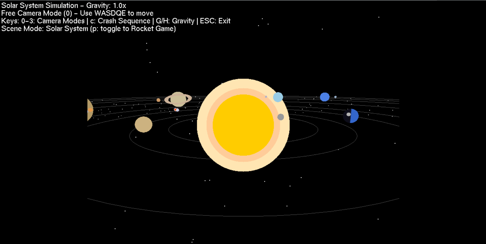
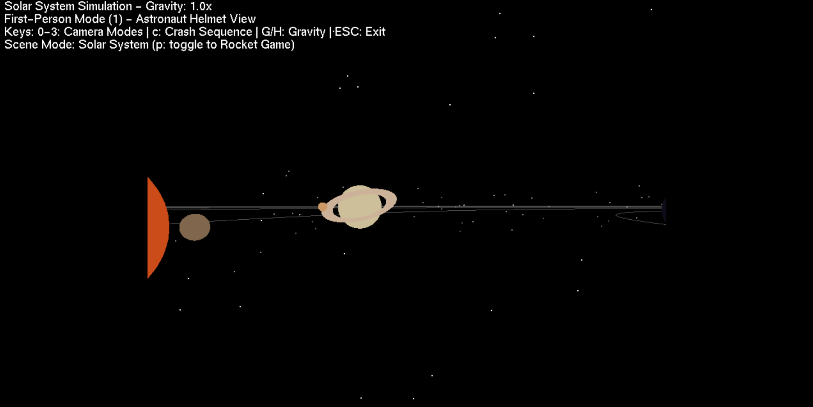
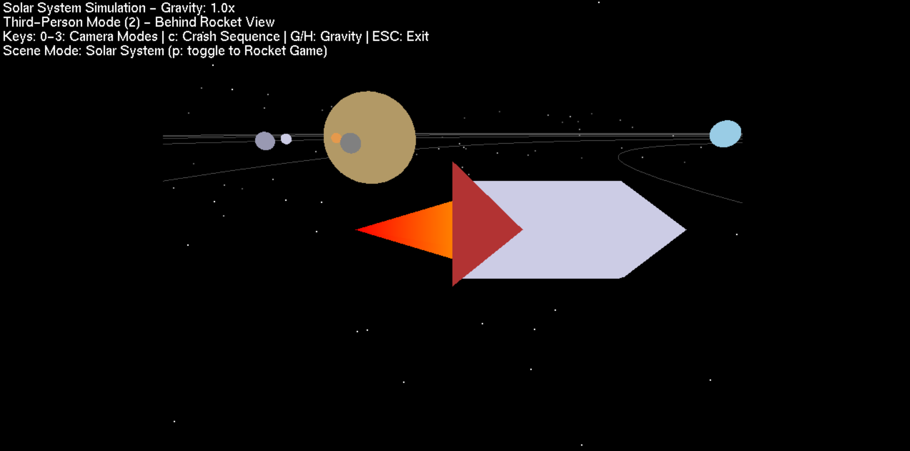
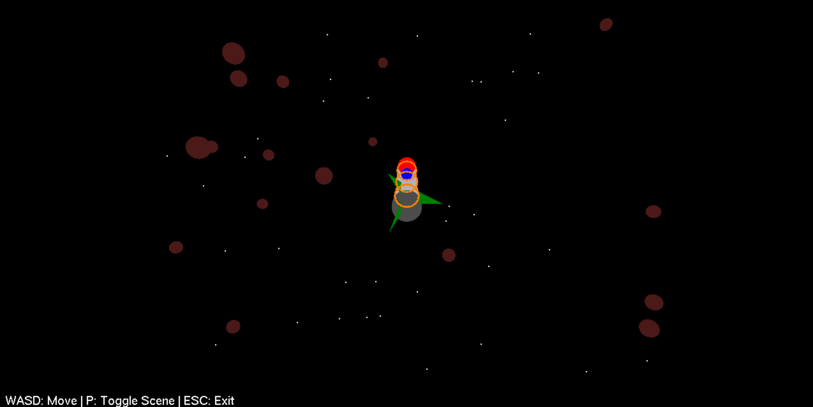

# 3D Solar System Simulation with Rocket Gameplay

*Figure 1: Planetary simulation mode*

*Figure 2: Planetary simulation from rocket*

 
*Figure 3: Another view*

*Figure 4: Rocket game mode*

## Project Overview
# ------------------------
A pure OpenGL implementation of a realistic solar system simulation with interactive rocket gameplay, built without using any built-in OpenGL lighting or rendering shortcuts (no `glEnable`, manual vertex/color handling). Developed as a Computer Graphics project.

**Group 10 - Final Project**  
*`Group10_project.py` is the complete, standalone executable file.*

## Key Features
# ------------------------

### 🌌 Solar System Simulation
- Realistic planetary orbits with Keplerian motion
- Accurate relative sizing of planets and distances
- Earth with dynamic day/night cycle (manual vertex coloring)
- Saturn with detailed rings (custom quadric implementation)
- Asteroid belt between Mars and Jupiter

### 🚀 Rocket Gameplay Mode
- Spaceship navigation with physics
- Meteor avoidance challenge
- Damage/repair mini-game system
- Mission objectives with timer

### 🎮 Interactive Elements
- Adjustable gravity simulation (G/H keys)
- Variable time speeds (,/.) 
- Multiple camera modes:
  - Free flight (WASD+QE)
  - Cockpit view 
  - Chase cam
  - Crash camera

## Technical Implementation
# ------------------------

### What We *DIDN'T* Use
- No `glEnable()` for lighting/depth
- No built-in material properties
- No GLSL shaders
- No texture mapping

### What We *DID* Use
- Pure vertex/color rendering
- Manual matrix transformations
- Custom orbital physics
- Procedural object generation
- State-machine based gameplay

## How It Works
# ------------------------

### Core Systems
1. **Planetary Motion**:
   # Orbit calculation example
   planet_x = orbit_radius * cos(angle)
   planet_z = orbit_radius * sin(angle)
   angle += speed * gravity_factor

2. **Collision Detection**:
   # Simple distance checking
    if distance(rocket,meteor) < threshold:
        take_damage()

3. **Camera System**:
   4 view modes with smooth transitions
   Manual gluLookAt() implementations

## User Guide
# ------------------------

*** Controls ***
Key	        Function
0-3	        Switch camera modes
WASD	    Move free camera
Q/E	        Move up/down
G/H	        Increase/decrease gravity
,/.	        Change time speed
P	        Toggle simulation/game modes
C	        Trigger crash sequence (in orbit mode)
ESC	        Quit

## Gameplay Mode
# ------------------------

Arrow Keys: Navigate rocket
Avoid red meteors
Collect green repair items when damaged
Reach the mission planet within time limit

## Running the Project
# ------------------------

1. Ensure you have:
    - Python 3.x
    - PyOpenGL (pip install PyOpenGL PyOpenGL_accelerate)
    - GLUT (freeglut for Windows/Mac, glut package for Linux)

2. Execute:
    - python Group10_project.py
    (Note: This is the complete final version - no other files are needed to run the project except OpenGL folder)

## Contributors
# ------------------------

    - Shami Islam Khan
    - Arittra Paul Ankur
    - Fahim Bin Arif

## Project Report | Demo Video
# ------------------------

*Click the thumbnail to watch full demo on YouTube*

